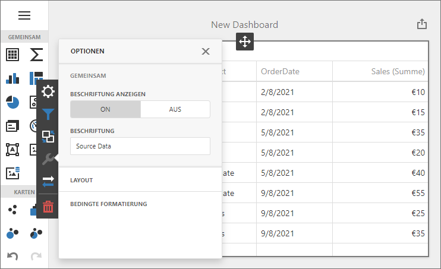

<!-- default badges list -->

<!-- default badges end -->
# Dashboard for ASP.NET Core - Localization
<!-- run online -->
**[[Run Online]](https://codecentral.devexpress.com/336051273/)**
<!-- run online end -->

The example shows how to localize an ASP.NET Core Dashboard application:

- Translate UI element captions to a different language: dialog boxes, buttons, menu items, error messages, etc.
- Format numbers, dates, and currencies according to specific culture settings.

## Example Structure

The example contains two projects that show how to use [predefined satellite assemblies](https://docs.devexpress.com/Dashboard/402535/web-dashboard/aspnet-core-dashboard-control/localization#add-predefined-satellite-assemblies) to localize the ASP.NET Core Dashboard control for the German market. Each project uses a different approach to [format dates, numbers, and currencies](https://docs.devexpress.com/Dashboard/402535#localize-dates-numbers-and-currencies).

### Intl

<!-- default file list -->
*Files to look at*:

* [Index.cshtml](./CS/DashboardLocalizationCore/Views/Home/Index.cshtml)
* [Startup.cs](./CS/DashboardLocalizationCore/Startup.cs)
<!-- default file list end -->

The **DashboardLocalizationCore** project uses _Intl_ to apply culture-specific formatting. The Web Dashboard control supports and uses this API out of the box.

### Globalize

<!-- default file list -->
*Files to look at*:

* [Index.cshtml](./CS/DashboardLocalizationManualCore/Views/Home/Index.cshtml)
* [Startup.cs](./CS/DashboardLocalizationManualCore/Startup.cs)
* [bundleconfig.json](./CS/DashboardLocalizationManualCore/bundleconfig.json)
<!-- default file list end -->

The **DashboardLocalizationManualCore** project shows how to use _Globalize_ instead of _Intl_.

If you add Globalize npm packages and reference these scripts in the ASP.NET Core application, the ASP.NET Core Dashboard control will use Globalize to format dates, numbers, and currencies. The project also shows how to apply custom formatting for numbers and dates.

## Documentation

- [Localize ASP.NET Core Dashboard Control](https://docs.devexpress.com/Dashboard/402535/web-dashboard/aspnet-core-dashboard-control/localization)

## More Examples

- [ASP.NET MVC Dashboard Control - Localization](https://github.com/DevExpress-Examples/asp-net-mvc-dashboard-localization)
- [ASP.NET Web Forms Dashboard Control - Localization](https://github.com/DevExpress-Examples/asp-net-web-forms-dashboard-localization)
- [Dashboard for Angular - Localization](https://github.com/DevExpress-Examples/angular-dashboard-localization)
- [Dashboard for React - Localization](https://github.com/DevExpress-Examples/react-dashboard-localization)
- [Dashboard for Vue - Localization](https://github.com/DevExpress-Examples/vue-dashboard-localization)
- [Dashboard Control for JavaScript Applications - Localization](https://github.com/DevExpress-Examples/javascript-dashboard-localization)
